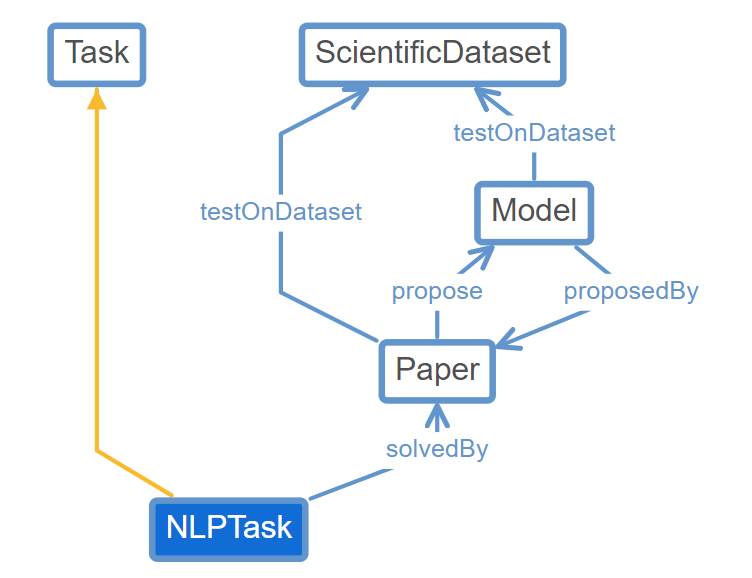
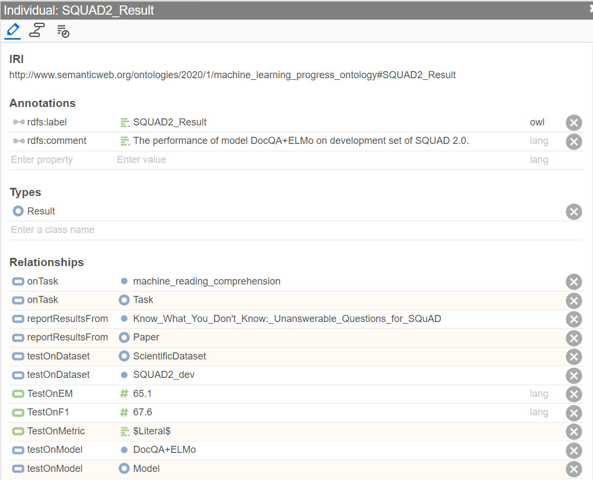

# Requirement
The code was implemented under Linux system. Please install the following libraries/softwares:

- Python 3.0 
- pytorch (https://github.com/pytorch/pytorch)
- pytorch_transformers (version 1.1.0 https://github.com/huggingface/transformers/releases/tag/1.1.0)
- MatchZoo-py(https://github.com/NTMC-Community/MatchZoo-py/tree/master/matchzoo)
- sklearn (https://scikit-learn.org/stable/)
- pandas
- numpy
- fuzzywuzzy (https://github.com/seatgeek/fuzzywuzzy)
- spaCy (https://spacy.io/)
- Owlready2(https://pypi.org/project/Owlready2/)

# Machine Learning Progress Ontology (MLPO)

The MLPO ontology definition is in [here](https://github.com/Zhiyu-Chen/Machine-Learning-Progress-Ontology/blob/master/data/sdo/mlpo.owx).
To explore the full ontology, you can load the file into [Protégé](https://protege.stanford.edu/) or [WebProtégé](https://webprotege.stanford.edu/).
We have 5 core entities: Task, Dataset, Result, Model and Paper.
Here we show the entity graph of NLPTask which is a subclass of Task: 

# Machine Learning Progress Knowledge Base (MEKB) Construction

To explore the constructed demo MPKB, you can load the file "./data/sdo/demo_db.owl" into Protégé or WebProtégé.
Here we show an example of Result individual: 

Run phase 1 (scientific entities recognition using CRF-LSTM)

- Training data should be formatted as below:
token/tag token/tag token/tag ...
token/tag token/tag token/tag ...

- create a folder called data that contains the data file data.all
- run ./prepare to obtain training and testing folds
- run python3 prepare_sent.py --data data/train to prepare the vocabularies and training 
- to train CRF-LSTM run python3 train.py --data data2/train.csv --epochs 100 --CharToIdx data/train.char_to_idx --WordToIdx data/train.word_to_idx --TagToIdx data/train.tag_to_idx --model_file data/phase1_model --valid data/valid
- use parameters.py to set up the parameters of the model
- for prediction, run python3 predict_sent.py --CharToIdx data/train.char_to_idx --WordToIdx data/train.word_to_idx --TagToIdx data/train.tag_to_idx --checkpoint data/phase1_model.epoch100 --test data/test
- for evaluation, after setting the correct arguments in predict.py code, run python3 evaluate.py --test data/test

Run phase 2 (IR-based relation extaction)

- cd Relation_Extraction_IR
- set the correct path to the collection of papers in metadata.py
- download glove.6B.50d.txt pretrained embedding from http://nlp.stanford.edu/data/glove.6B.zip
- to train and validate the IR based model, run convknrm_pointwise.py --emsize X --device GPU-ID --nbins 5 --pretrained_embedding path_to/glove.6B.Xd.txt
X=50 when using glove.6B.50d.txt

Run phase 2 (NLI-based relation extaction)

- set the relation type variable "relation_type" in nli_relation.py. "TD" for task-dataset relationship and "DM" for dataset-metric relationship.
- run in command line with "python nli_relation.py".

Pipeline Demo

- cd PipelineDemo
- to prepare an input paper, run python3 InputDemo.py --input_file data/test --output_file data2/demo.input --paper_id 1
- to extract TDM triples from paper that are used to build the knowledge graph, run python3 extract_triples_from_paper.py --CharToIdx data/train.char_to_idx --WordToIdx data/train.word_to_idx --TagToIdx data/train.tag_to_idx --test data/demo.input --checkpoint data/phase1_model.epoch100 --pretrained_embedding path_to/glove.6B.Xd.txt --phase2_model Relation_Extraction_IR/stage2_model.pt
- to extract triples from all the papers collection, and form the input file kb_input.txt to the knowledge base, run python3 extract_all_triples.py   

Build KB

- make sure the output from the 2nd stage is in "./PipelineDemo/kb_input.txt'"
- run in command line with "python build_kb.py", and the file "./data/sdo/demo_db.owl" will be generated as the knowledge base.
